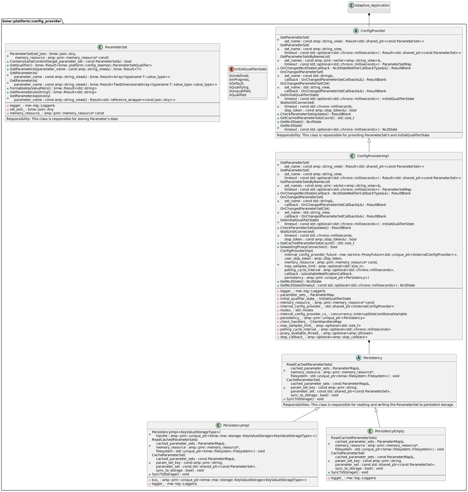
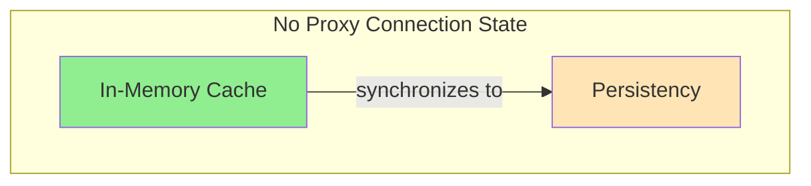
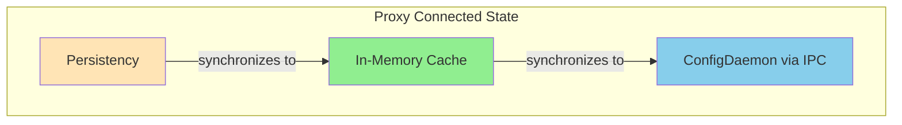
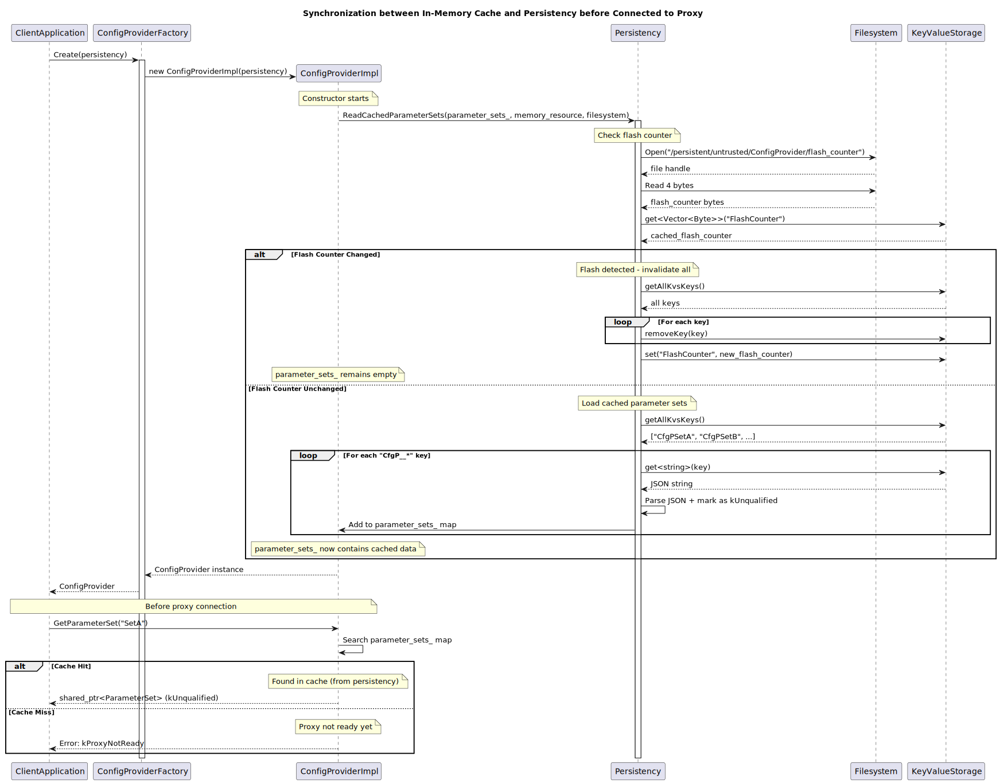
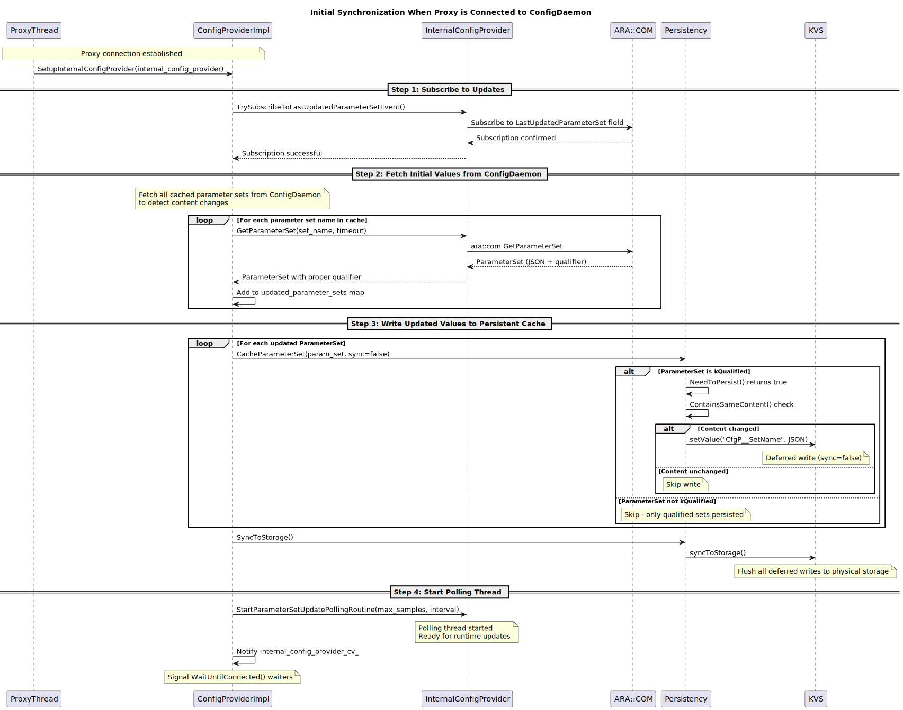
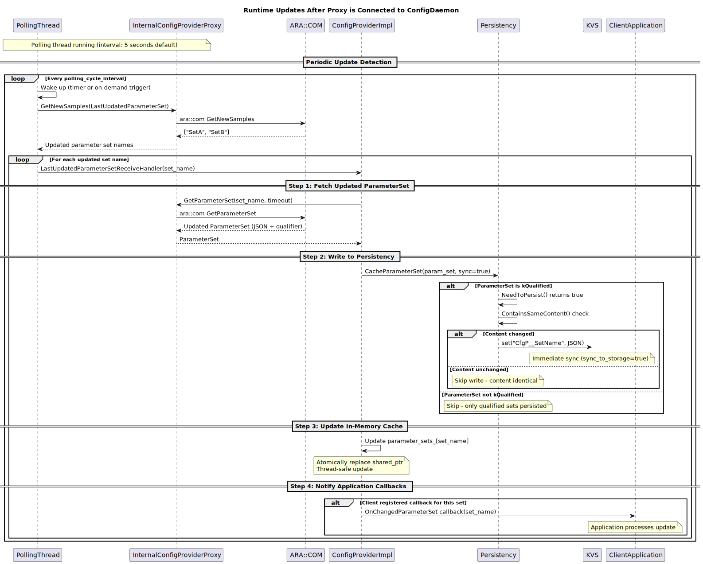

# Detailed Design for ConfigProvider

## Table of Contents

1. [Introduction](#1-introduction)
2. [External interfaces](#2-external-interfaces)
   - 2.1 [IPC Interface](#21-ipc-interface)
   - 2.2 [Filesystem Interface](#22-filesystem-interface)
3. [Static architecture](#3-static-architecture)
   - 3.1 [Construction](#31-construction)
   - 3.2 [ParameterSet Access through IPC Communication](#32-parameterset-access-through-ipc-communication)
     - 3.2.1 [Polling-Based Update Notification Mechanism](#321-polling-based-update-notification-mechanism)
   - 3.3 [Data Synchronization in Persistency](#33-data-synchronization-in-persistency)
     - 3.3.1 [Persistency](#331-persistency)
     - 3.3.2 [Invalidation of Persistent Parameter Cache](#332-invalidation-of-persistent-parameter-cache)
     - 3.3.3 [Update content of Persistent Parameter Cache](#333-update-content-of-persistent-parameter-cache)
   - 3.4 [In-Memory Cache Management](#34-in-memory-cache-management)
     - 3.4.1 [State-Dependent Synchronization Implementation](#state-dependent-synchronization-implementation)
     - 3.4.2 [Cache-First Access Pattern (IPC Avoidance)](#cache-first-access-pattern-ipc-avoidance)
4. [Dynamic architecture](#4-dynamic-architecture)
   - 4.1 [Instantiation](#41-instantiation)
   - 4.2 [Before Connected to Proxy](#42-before-connected-to-proxy)
   - 4.3 [When Connected to Proxy](#43-when-connected-to-proxy)
   - 4.4 [After Proxy is connected](#44-after-proxy-is-connected)
   - 4.5 [GetParameterSet Behavior](#45-getparameterset-behavior)
5. [External Dependencies](#5-external-dependencies)

## 1. Introduction

Client applications use this library as a communication channel to `ConfigDaemon` to fetch `ParameterSet` instances. After creating a `ConfigProvider` handler, users can either get `ParameterSet` directly or subscribe to specific parameter sets and receive notifications when data is updated.

The `ConfigProvider` library implements three core optimization strategies to enhance performance and meet automotive timing requirements:

1. **Polling-Based Update Notification**: Instead of relying on middleware event-driven mechanisms, the proxy layer uses polling to check for parameter set updates, reducing runtime overhead and providing deterministic control over update checking frequency.

2. **Persistent Parameter Caching**: To enable fast application startup before ConfigDaemon connection is available, parameter sets are cached in persistent storage, allowing immediate access to configuration data from previous lifecycles. In general, there are 2 synchronization problems to be resolved:

    - **Only the `ParameterSet`'s content is changed**: One of the `Plugins` inside `ConfigDaemon` updates the `ParameterSetCollection` and changes the value of one `ParameterSet`. The client application would see different content when querying the same `ParameterSet` name from `ConfigDaemon` and from `Persistency`. In such a case, the `Persistency` needs to be synchronized with data from IPC whenever there is a new content change.

    - **The `ParameterSet`'s name is changed**: In this scenario, the client application might use different code when querying for the same content. If there is a flash of new software, the `param_set_mapping.json` file might be updated, and the persisted `ParameterSet`'s key-value mapping is obsolete in general. In such a case, the persisted data needs to be dropped completely.

3. **In-Memory Cache and Synchronization**: ConfigProvider maintains an internal cache of parameter sets that serves as the single source of truth during runtime, mediating between persistent storage and IPC communication to optimize access latency and ensure data consistency. From a functional point of view, `ConfigProvider` always fetches content from this cache, while providing mechanisms to ensure:

    * When there is no proxy connection to `ConfigDaemon`, the cache contains `ParameterSet` from `Persistency`.
    * When there is a proxy connection to `ConfigDaemon`, the cache contains the latest `ParameterSet` from `ConfigDaemon`.

These optimizations address critical automotive requirements: predictable runtime behavior, minimal access latency, and fast startup for safety-critical systems.

## 2. External interfaces

### 2.1 IPC Interface
- Application `ConfigDaemon` to get and subscribe `ParameterSet` via `InternalConfigProvider` interface represented by `InternalConfigProviderProxy` class.
### 2.2 Filesystem Interface
- `/persistent/trusted/{ClientAppName}/nvmblock/key_value_storage`: This file contains persisted `ParameterSet`. This data will be loaded and used in the next lifecycle before connection to `ConfigDaemon` is established.

## 3. Static architecture
### 3.1 Construction

**ConfigProviderFactory**: Client application is expected to create `ConfigProvider` with this class. It offers several config options to the user.

1. Whether or not to be blocked and wait for the connection of proxy for certain period.
2. Whether or not to register a callback function to be triggered when the connection to proxy is successful.
3. Max buffer size to cache updated event for subscription.
4. Polling frequency for subscription.
5. Whether or not to use persistency caching.

**PersistencyFactory**: Client application is expected to create `Persistency` with this class by providing an existing handle to `KeyValueStorage` Type.

<details>
<summary>Construction Class Diagram</summary>

</details>

### 3.2 ParameterSet Access through IPC Communication

This section describes the components and mechanisms that enable client applications to access `ParameterSet` from `ConfigDaemon` through IPC, including the data types exchanged and the update notification strategy.

**InternalConfigProvider (Proxy)**: Internal abstraction layer that encapsulates all IPC communication with `ConfigDaemon`, decoupling the client API from middleware technology. It has the following responsibilities:
- **IPC Abstraction**: Handles all `mw::com` communication details including encoding/decoding of `ParameterSet`, timeout management, and connection lifecycle
- **Synchronous Retrieval**: Provides `GetParameterSet()` method returning typed `ParameterSet` objects
- **Field Subscription**: Subscribes to `LastUpdatedParameterSet` field from `ConfigDaemon` using `Subscribe(max_samples_limit_)`
- **Polling-Based Update Detection**: Implements polling routine using `GetNewSamples()` to check for `ParameterSet` updates without event handlers
- **Qualifier State Access**: Retrieves `InitialQualifierState` indicating the qualification status

**ParameterSet**: Type-safe container encapsulating a logical grouping of configuration parameters with JSON representation. It offers templated `GetParameterAs<T>()` methods supporting primitives, 1D arrays, and 2D arrays with compile-time type checking.

**InitialQualifierState**: Enum representing the overall qualification state of configuration data, indicating whether parameters can be used for safety-critical purposes. States include: `kDefault`, `kInProgress`, `kQualifying`, `kQualified`, `kUnqualified`, `kUndefined`.

<details>
<summary>Proxy Class Diagram</summary>

</details>

#### 3.2.1 Polling-Based Update Notification Mechanism

Instead of using traditional event-driven notification (`SetReceiveHandler()`), `InternalConfigProvider` implements a polling-based approach for detecting `ParameterSet` updates, providing performance optimization and deterministic behavior.

**Polling Thread Management:**
- `InternalConfigProvider` creates a dedicated thread via `StartParameterSetUpdatePollingRoutine()` that runs independently from application threads
- Thread periodically calls `proxy_->LastUpdatedParameterSet.GetNewSamples()` to retrieve names of updated parameter sets
- Uses `polling_routine_cv_` condition variable for efficient sleeping between polling cycles

**Subscription Without Event Handlers:**
- Subscribes to `LastUpdatedParameterSet` field using `Subscribe(max_samples_limit_)` to enable sample buffering
- Does NOT use `SetReceiveHandler()` - explicitly avoids event-driven processing
- Polling thread actively retrieves samples via `GetNewSamples()` API instead of waiting for event callbacks

**Update Detection and Notification Flow:**
1. Polling thread wakes up (either by timer or via `CheckParameterSetUpdates()` call)
2. Calls `GetNewSamples(callback, free_slots_in_samples_container)` to retrieve updated `ParameterSet` names
3. Collected names are stored in `last_updated_parameter_set_names_` container (capacity limited by `max_samples_limit_`)
4. For each name, invokes `on_changed_parameter_set_callback_` registered by the client
5. Client receives callback, fetches updated `ParameterSet` via `GetParameterSet()`, updates cache, and notifies registered application callbacks

**Configuration Parameters:**
- `max_samples_limit_`: Maximum buffer capacity for `ParameterSet` names between polling cycles (default: 500)
- `polling_cycle_interval_`: Time interval between automatic polling attempts (default: 5 seconds)

**Trigger Mechanisms:**
- **Automatic Polling**: Thread wakes up periodically based on `polling_cycle_interval_`
- **On-Demand Polling**: Client calls to `CheckParameterSetUpdates()` trigger immediate polling via `polling_routine_cv_.notify_one()`

### 3.3 Data Synchronization in Persistency
#### 3.3.1 Persistency

**Persistency**: This optional module provides persistent caching of `ParameterSet` to enable fast application startup before `ConfigDaemon` connection is available. It offers three core responsibilities reflected in its interface:

1. **Read Cached Parameter Sets** (`ReadCachedParameterSets`): Loads previously stored `ParameterSet` from key-value storage into `ConfigProvider`'s internal cache. All loaded `ParameterSet` are marked `UNQUALIFIED` since they haven't undergone qualification in the current lifecycle.

2. **Store Parameter Sets** (`CacheParameterSet`): Persists `ParameterSet` to key-value storage. Only `ParameterSet` with `kQualified` state are stored, ensuring cached data has been validated. The implementation compares new `ParameterSet` content with cached versions to avoid unnecessary writing when data hasn't changed (addresses first synchronization issue in 1.1).

3. **Sync to Storage** (`SyncToStorage`): Forces synchronization of all cached `ParameterSet` to physical storage, with configurable immediate or deferred sync strategies to balance data durability and performance.

<details>
<summary>Persistency Class Diagram</summary>

</details>

#### 3.3.2 Invalidation of Persistent Parameter Cache

To address the second synchronization issue of **Persistent Parameter Caching** where `ParameterSet` names may change after software flashing, cached `ParameterSet` shall be cleared (invalidated) after a successful flash procedure to avoid any misinterpretation of an old `ParameterSet` in context of a newer software image.

The implementation uses `PLMS Maintenance Hook`. PLMS executes a script `count_flash` after every successful flash procedure, which creates/updates a file `/persistent/untrusted/ConfigProvider/flash_counter` with following permissions:

|mode|flags|
|--------------------|---|
|directory mode flags|755|
|file mode flags|644|

If the file doesn´t exist, the script creates it. The file contains 4 bytes taken from random source provided by QNX through `/dev/random`. On every execution, the script reads the first 4 bytes from the file, takes 4 bytes from random source, compares both sets and if they are different, writes the new set of bytes to the file. If not, it repeats the process until the values are different.

New primary `GID = 11001` and `UID = 11001` are applicable for the users of the file. PLMS has exclusive write access to this file. The PLMS script `count_flash` provides a component description `plms-count-flash.cfg`:

```
component "plms-count-flash" {
    depend = ["plms-score-persistency-init:stateless", "plms-score-filesystem-apps-init:stateless"]

    task "main" {
        stype = "count_flash_t"
        groups = [11001]
        user = "11001:11001"
        command = "/usr/sbin/count_flash"
        stdout = "/dev/slog2/stdout:a"
        stderr = "/dev/slog2/stderr:a"
    }
}
```

`plms-count-flash` is registered in `plms-score-startup-maintenance.cfg` to be activated in the maintenance hook, which is executed before any user of cached parameter sets.

Any application using `ConfigProvider` library for persistent caching has read access to the flash counter file. `ConfigProvider` maintains its own copy of the flash counter in the same KVS where parameter sets are cached. On call of `PersistencyFactory::Create()`, `ConfigProvider` opens the file to compare the flash counter with the stored copy. If the copy doesn´t exist yet or if there's a deviation, the copy is updated with the new value and every cached parameter set is removed from the key-value store. Deviation is detected using `==` or `!=` operators (no `<` or `>`) to handle integer overflow. Input validation checks data size first, then performs conversion. If validation fails, the flash counter is considered non-existent and deviation is detected.

**Safety Note**: Cached parameter sets loaded from persistency are marked `UNQUALIFIED` since they haven't undergone qualification in the current lifecycle—each safety-critical application must provide safety argumentation justifying the use of unqualified parameters during startup.


#### 3.3.3 Update content of Persistent Parameter Cache

To keep persistent cache synchronized with runtime configuration changes, `ConfigProvider` implements a continuous synchronization mechanism between the in-memory cache and `Persistency` layer. The detailed implementation of this synchronization strategy, including the three-tier architecture (Persistency → In-Memory Cache → IPC) and state-dependent synchronization flows, is described in [Section 3.4 In-Memory Cache Management](#34-in-memory-cache-management).


### 3.4 In-Memory Cache Management

`ConfigProvider` implements an in-memory cache (`parameter_sets_`) as the central data store for all `ParameterSet` access. The cache acts as a synchronization hub that adapts its data source based on `ConfigDaemon` connection state.

#### 3.4.1 State-Dependent Synchronization Architecture

**1. No Proxy Connection State - Persistency to Cache Synchronization**

The cache supports loading from persistency to enable fast startup:

- **Loading Mechanism**: `Persistency::ReadCachedParameterSets()` populates the cache from key-value storage
- **Qualification State Marking**: Loaded parameter sets carry `kUnqualified` state
- **Data Source Priority**: Cache serves as single source of truth, populated from persistency when proxy unavailable




**2. Proxy Connected State - Bidirectional Synchronization**

When proxy connection is available, the cache mediates between `ConfigDaemon` and `Persistency`:

**a) ConfigDaemon to Cache Synchronization (Primary Data Flow)**

The cache receives updates from `ConfigDaemon` through two mechanisms:

- **Subscription-Based Updates**: Polling thread retrieves changed parameter set names via `GetNewSamples()` on the `LastUpdatedParameterSet` field. When updates are detected, the system fetches fresh values and atomically replaces cache entries.
- **On-Demand Fetching**: Cache miss triggers direct IPC fetch via `InternalConfigProvider::GetParameterSet()`. The fetched parameter set is added to cache before returning to caller.


**b) Cache to Persistency Synchronization (Persistence Layer)**

The cache propagates qualified updates to persistency for durability across lifecycles:

- **Write Trigger**: When cache receives updated parameter sets from ConfigDaemon, `Persistency::CacheParameterSet()` is called to persist qualified changes
- **Qualification Filter**: `PersistencyImpl::NeedToPersist()` ensures only `kQualified` parameter sets are persisted
- **Content Comparison**: `ContainsSameContent()` method avoids redundant writes when content unchanged
- **Persistence Strategy**: Configurable immediate (`sync_to_storage=true`) flushes after each write, or deferred mode batches writes for better performance




#### 3.4.2 Cache-First Access Pattern

The access pattern prioritizes cache lookup to minimize IPC operations:

1. **Primary Access Path**: Cache lookup in `parameter_sets_` map
2. **Return Type**: `shared_ptr<const ParameterSet>` for zero-copy access and immutability
3. **Fallback Mechanism**: IPC fetch to `InternalConfigProvider` when cache miss occurs (proxy-connected state only)
4. **Cache Population**: Fetched parameter sets automatically added to cache

This pattern ensures consistent data access through a unified cache interface regardless of underlying data source.

## 4. Dynamic architecture

### 4.1 Instantiation

The `ConfigProvider` library supports two instantiation patterns to accommodate different application startup requirements: blocking and non-blocking creation.

* When client applications can wait for qualification before getting `ParameterSet` during startup, they use the blocking factory method. The factory internally calls `WaitUntilConnected()` on the proxy, blocking the calling thread until either the connection to `ConfigDaemon` is established or a timeout occurs. This approach guarantees that the returned `ConfigProvider` instance has an active connection and can serve parameter set requests via IPC immediately.

<details>
<summary>Client Application Instantiate ConfigProvider in Blocking Way</summary>

</details>

* For applications that do not want to wait for qualification, the non-blocking factory method returns a `ConfigProvider` instance immediately, regardless of proxy connection status. The client must provide a callback function that will be invoked asynchronously once the proxy connection is successfully established. During the period before connection, `GetParameterSet()` requests are still served from the persistent cache (if enabled) or return `kProxyNotReady` errors. This pattern enables parallel initialization where configuration access and other startup tasks can proceed concurrently.

<details>
<summary>Client Application Instantiate ConfigProvider in non-Blocking Way</summary>

</details>

Both patterns follow the same internal construction sequence: creating the `InternalConfigProvider` proxy, initializing the `Persistency` layer (if enabled), loading cached parameter sets into memory, and starting the polling thread for update notifications. The key difference is whether the factory waits for proxy connection completion before returning control to the client.


### 4.2 Before Connected to Proxy

Before the connection to proxy is established, `ConfigProvider` operates in a persistency-backed mode that enables immediate access to configuration data from previous lifecycles. This phase addresses the critical automotive requirement of fast application startup without waiting for IPC infrastructure to become available.

**Persistency-Backed Operation:**
When `ConfigProviderFactory::Create()` is called, the factory internally creates a `Persistency` instance (if persistency caching is enabled) and immediately triggers the loading of all cached parameter sets from the key-value storage into the in-memory cache. This loading process is synchronous during construction, ensuring that by the time the factory returns the `ConfigProvider` instance to the client, the cache is fully populated with data from the previous lifecycle. This allows `GetParameterSet()` calls to succeed immediately, even though no connection to `ConfigDaemon` exists yet. Before loading any cached parameter sets, the persistency layer performs a critical validation step as shown in [Section 3.3.2 Invalidation of Persistent Parameter Cache](#32-parameterset-access-through-ipc-communication).


During this phase, `GetParameterSet()` operates in cache-only mode, serving requests from persistency-backed data with `kUnqualified` state or returning `kProxyNotReady` errors for cache misses. Detailed `GetParameterSet()` behavior across all connection states is described in [Section 4.5 GetParameterSet Behavior](#45-getparameterset-behavior).

<details>
<summary>Before Connect to Proxy</summary>

</details>

### 4.3 When Connected to Proxy

When the proxy connection to `ConfigDaemon` is successfully established, `ConfigProvider` transitions from persistency-backed mode to a fully synchronized operational mode. This transition triggers a comprehensive synchronization process that reconciles the cached data (loaded from persistency during startup) with the current live configuration data maintained by `ConfigDaemon`.

Upon detecting the proxy connection (either through `WaitUntilConnected()` in blocking mode or through the proxy-ready callback in non-blocking mode), `ConfigProvider` immediately initiates a bidirectional synchronization sequence. First, it subscribes to the `LastUpdatedParameterSet` field from `ConfigDaemon` to enable ongoing update notifications through the polling mechanism described in section 3.2.1. Then, for each parameter set name currently present in the in-memory cache (loaded from persistency), the system fetches the fresh value from `ConfigDaemon` via IPC and performs a content comparison using `ContainsSameContent()`. This comparison is crucial because it distinguishes between parameter sets whose values have actually changed versus those that remain identical to their cached versions, avoiding unnecessary write operations to persistency.

Following the initial synchronization, the system establishes the full three-tier data flow pattern: `ConfigDaemon` → In-Memory Cache → Persistency. The in-memory cache becomes the single source of truth that mediates between the live IPC connection and persistent storage. Updates flow from `ConfigDaemon` through the cache and into persistency (for qualified parameter sets only). Application requests are served using the cache-first access pattern described in [Section 4.5 GetParameterSet Behavior](#45-getparameterset-behavior), ensuring microsecond-level response times.

<details>
<summary>When Proxy is connected</summary>

</details>


### 4.4 After Proxy is connected

After the initial synchronization completes and the proxy connection is fully established, `ConfigProvider` enters its steady-state runtime operation mode. In this phase, the system continuously monitors for configuration changes in `ConfigDaemon` and propagates updates through the three-tier architecture while maintaining optimal performance for application requests.

**Continuous Polling Operation:**
The polling thread, which was activated during the initial synchronization in section 4.3, now operates in a continuous loop with configurable intervals (default 5 seconds defined by `polling_cycle_interval_`). At each polling cycle, the thread wakes up and calls `GetNewSamples()` on the `LastUpdatedParameterSet` field subscription to retrieve the names of parameter sets that have been modified in `ConfigDaemon` since the last check. This polling-based approach provides deterministic behavior without the overhead and complexity of event-driven middleware mechanisms. The thread can also be triggered on-demand through the `CheckParameterSetUpdates()` API, allowing applications to force immediate update checks when necessary, for example after receiving external signals indicating configuration changes.

When the polling thread detects updated parameter set names, it initiates a systematic propagation sequence for each updated parameter set. First, the system fetches the fresh parameter set content from `ConfigDaemon` via IPC, obtaining both the updated values and the current qualification state. Next, it performs an atomic update of the in-memory cache by replacing the existing `shared_ptr<const ParameterSet>` entry with the new data, ensuring thread-safe access for concurrent `GetParameterSet()` requests. If the updated parameter set has `kQualified` status, the system then writes it to persistency using `CacheParameterSet()`, which internally performs content comparison with `ContainsSameContent()` to avoid unnecessary storage writes when only metadata has changed. Finally, after the cache and persistency updates are complete, the system invokes any registered client callbacks to notify the application that new configuration data is available.

**Client Callback Notification:**
Applications that have registered callbacks via the subscription mechanism receive asynchronous notifications when parameter sets are updated. These callbacks are invoked from the polling thread after the cache and persistency synchronization completes, ensuring that when the callback executes, the application can immediately call `GetParameterSet()` and receive the updated data from the cache. This design provides a clear contract: by the time the application receives the update notification, all internal synchronization has completed and the new data is ready for consumption. Applications can choose to process these updates in the callback itself or use the notification as a trigger to schedule processing on their own threads.

Throughout this runtime operation phase, all `GetParameterSet()` requests continue to follow the cache-first access pattern, providing microsecond-level response times. The detailed behavior is described in [Section 4.5 GetParameterSet Behavior](#45-getparameterset-behavior).

<details>
<summary>After Proxy is connected</summary>

</details>


### 4.5 GetParameterSet Behavior

The `GetParameterSet()` method retrieves configuration data from `ConfigProvider` using a cache-first access pattern that adapts based on proxy connection state.

**Cache-First Access Pattern:**
All requests check the in-memory cache first, providing microsecond-level response times for cached data, minimizing expensive IPC operations, and ensuring thread-safe concurrent access through immutable `shared_ptr<const ParameterSet>` returns. The cache always serves the most current available data, whether from persistency during startup or from `ConfigDaemon` when connected.

**Before Proxy Connection:**
- Cache hit: Returns immediately with `kUnqualified` state (loaded from persistency)
- Cache miss: Returns `kProxyNotReady` error (cannot fetch from ConfigDaemon)

**After Proxy Connection:**
- Cache hit: Returns immediately with proper qualification state from `ConfigDaemon`
- Cache miss: Fetches via IPC, atomically updates cache, writes to persistency if `kQualified`, then returns

**Error Handling:**
Returns `Result<shared_ptr<const ParameterSet>>` with success or error codes:
- `kProxyNotReady`: Parameter set not in cache and no proxy connection
- `kParameterSetNotFound`: Doesn't exist in cache or ConfigDaemon
- `kTimeout`: IPC fetch exceeded timeout
- `kInternalError`: Unexpected failure

<details>
<summary>GetParameterSet Sequence Diagram</summary>

</details>

Following sequence diagram describes the principle of GetParameterAs() method of ParameterSet class to access a typed value of a parameter by its name.

<details>
<summary>GetParameterAs Sequence Diagram</summary>

</details>


## 5. External Dependencies
|Dependency|Type|Components|Purpose|
|----------|----|----------|-------|
|//score/config_management/config_daemon/code/data_model:parameter_set_qualifier|Static library|//score/config_management/ConfigProvider/code/parameter_set:parameter_set|Qualification of parameters|
|//platform/aas/mw/log:log|Static library|multiple|Logging framework|
|//platform/aas/mw/service|Static library|multiple|Framework for handling mw::com service discovery|
|//platform/aas/mw/storage/key_value_storage|Optional static library|multiple|Wrapper around mw::per KVS used to persists cached parameter sets|
|@score_baselibs//score/json:json|Static library|multiple|Framework allowing to use json parser and to perform various attribute parsing and writing operations|
|@score_baselibs//score/result:result|Static library|multiple|Enhance error handling with [result type](https://en.wikipedia.org/wiki/Result_type)|
|@score_baselibs//score/concurrency:interruptible_wait|Static library|WaitForWrapperImpl class|Used to conditionally wait for stop_requested on token stop_source or expired timeout|
|@amp//:amp|Static library|Multiple class|AMP extends the C++ Standard Library with modules that are not included in the C++ Standard Library or cannot be used due to embedded restrictions|
|@score_baselibs//score/concurrency:condition_variable|Static library|//score/config_management/ConfigProvider/code/proxies/details:internal_config_provider_impl_mw_com|This library is used as an extension of std::condition_variable_any with support to get woken up via score::cpp::stop_token. [Refer InterruptibleConditionalVariableBasic for more info](broken_link_g/swh/ddad_platform/blob/master/aas/lib/concurrency/condition_variable.h)|
