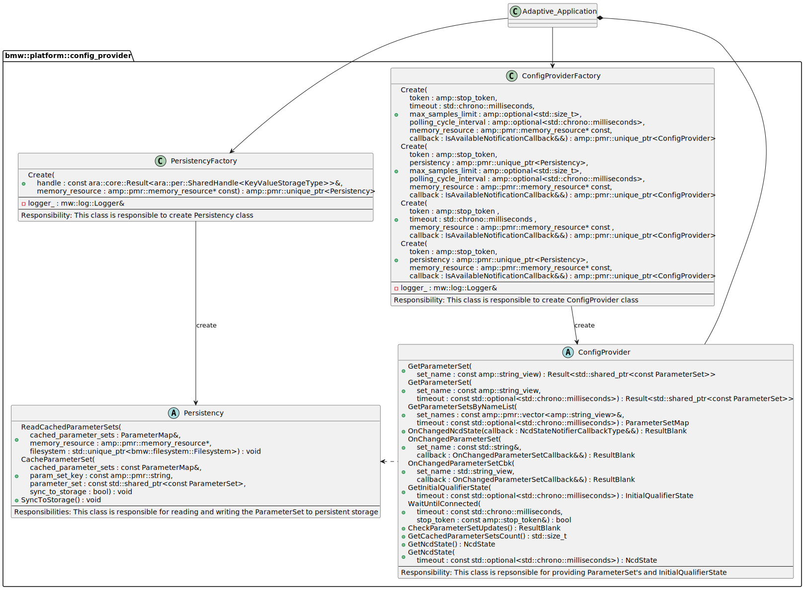
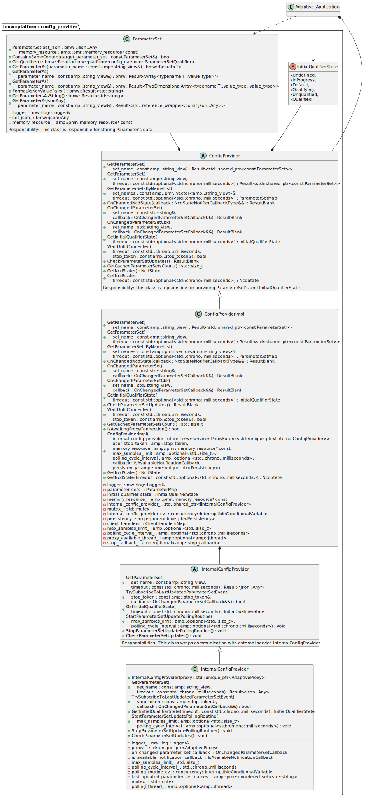
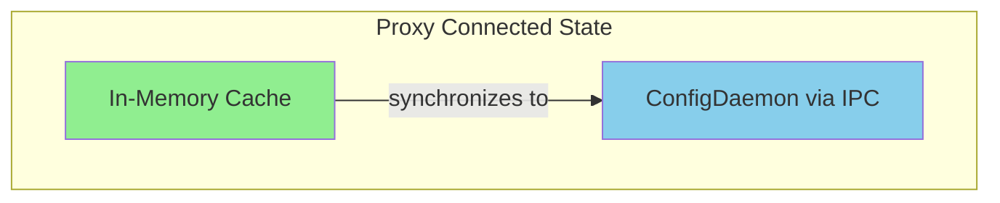
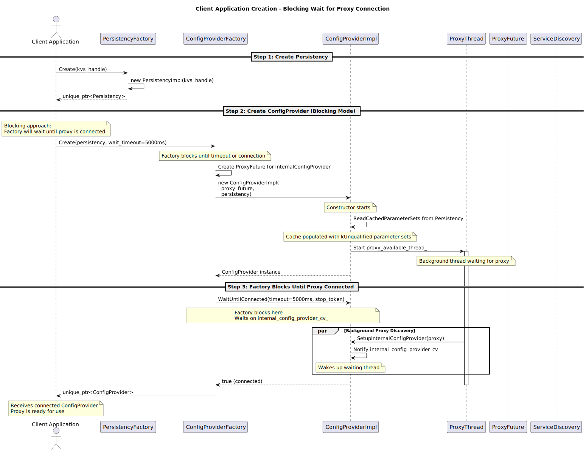
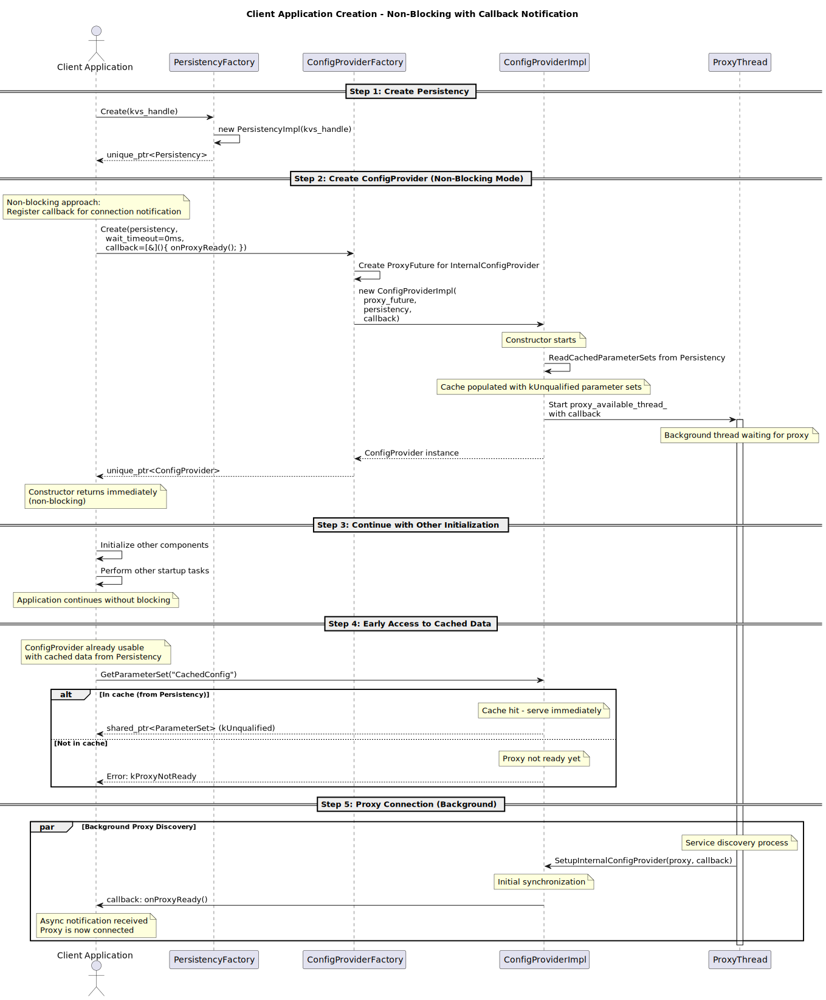
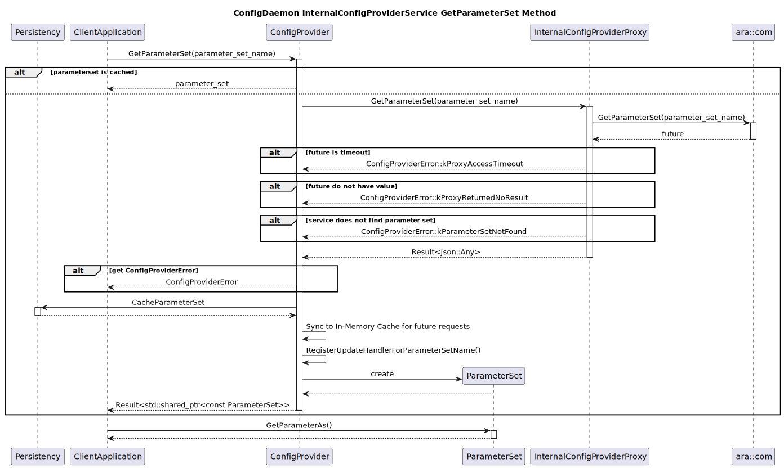
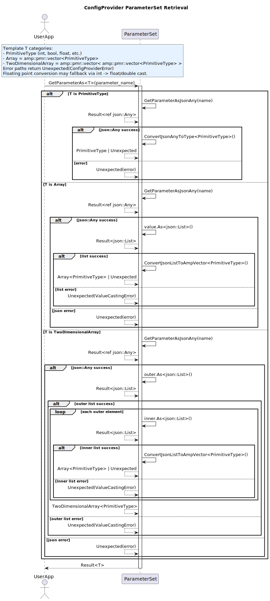

# Detailed Design for ConfigProvider

## Table of Contents

1. [Introduction](#1-introduction)
2. [External interfaces](#2-external-interfaces)
   - 2.1 [IPC Interface](#21-ipc-interface)
3. [Static architecture](#3-static-architecture)
   - 3.1 [Construction](#31-construction)
   - 3.2 [ParameterSet Access through IPC Communication](#32-parameterset-access-through-ipc-communication)
     - 3.2.1 [Polling-Based Update Notification Mechanism](#321-polling-based-update-notification-mechanism)
   - 3.3 [In-Memory Cache Management](#33-in-memory-cache-management)
     - 3.3.1 [State-Dependent Synchronization Architecture](#331-state-dependent-synchronization-architecture)
     - 3.3.2 [Cache-First Access Pattern (IPC Avoidance)](#332-cache-first-access-pattern-ipc-avoidance)
4. [Dynamic architecture](#4-dynamic-architecture)
   - 4.1 [Instantiation](#41-instantiation)
   - 4.2 [Before Connected to Proxy](#42-before-connected-to-proxy)
   - 4.3 [When Connected to Proxy](#43-when-connected-to-proxy)
   - 4.4 [After Proxy is connected](#44-after-proxy-is-connected)
   - 4.5 [GetParameterSet Behavior](#45-getparameterset-behavior)
5. [External Dependencies](#5-external-dependencies)

## 1. Introduction

Client applications use this library as a communication channel to `ConfigDaemon` to fetch `ParameterSet` instances. After creating a `ConfigProvider` handler, users can either get `ParameterSet` directly or subscribe to specific parameter sets and receive notifications when data is updated.

The `ConfigProvider` library implements two core optimization strategies to enhance performance and meet automotive timing requirements:

1. **Polling-Based Update Notification**: Instead of relying on middleware event-driven mechanisms, the proxy layer uses polling to check for parameter set updates, reducing runtime overhead and providing deterministic control over update checking frequency.

2. **In-Memory Cache and Synchronization**: ConfigProvider maintains an internal cache of parameter sets that serves as the single source of truth during runtime, mediating between IPC communication to optimize access latency and ensure data consistency. From a functional point of view, `ConfigProvider` always fetches content from this cache, while providing mechanisms to ensure:

    * When there is a proxy connection to `ConfigDaemon`, the cache contains the latest `ParameterSet` from `ConfigDaemon`.

These optimizations address critical automotive requirements: predictable runtime behavior, minimal access latency, and fast startup for safety-critical systems.

## 2. External interfaces

### 2.1 IPC Interface
- Application `ConfigDaemon` to get and subscribe `ParameterSet` via `InternalConfigProvider` interface represented by `InternalConfigProviderProxy` class.

## 3. Static architecture
### 3.1 Construction

**ConfigProviderFactory**: Client application is expected to create `ConfigProvider` with this class. It offers several config options to the user.

1. Whether or not to be blocked and wait for the connection of proxy for certain period.
2. Whether or not to register a callback function to be triggered when the connection to proxy is successful.
3. Max buffer size to cache updated event for subscription.
4. Polling frequency for subscription.

> **Note**: In SCORE, persistency is not supported. Client applications do **not** create a `Persistency` instance and do **not** interact with `PersistencyFactory`. When `ConfigProviderFactory::Create()` is called without a `Persistency` argument, the factory automatically instantiates `PersistencyImpl` internally — a no-op implementation where `ReadCachedParameterSets()`, `CacheParameterSet()`, and `SyncToStorage()` are all silent no-ops. The class diagram below reflects the full design; in SCORE the `PersistencyFactory` and `Persistency` components shown are replaced by the internally managed `PersistencyImpl`.

Construction Class Diagram

### 3.2 ParameterSet Access through IPC Communication

This section describes the components and mechanisms that enable client applications to access `ParameterSet` from `ConfigDaemon` through IPC, including the data types exchanged and the update notification strategy.

**InternalConfigProvider (Proxy)**: Internal abstraction layer that encapsulates all IPC communication with `ConfigDaemon`, decoupling the client API from middleware technology. It has the following responsibilities:
- **IPC Abstraction**: Handles all `mw::com` communication details including encoding/decoding of `ParameterSet`, timeout management, and connection lifecycle
- **Synchronous Retrieval**: Provides `GetParameterSet()` method returning typed `ParameterSet` objects
- **Field Subscription**: Subscribes to `LastUpdatedParameterSet` field from `ConfigDaemon` using `Subscribe(max_samples_limit_)`
- **Polling-Based Update Detection**: Implements polling routine using `GetNewSamples()` to check for `ParameterSet` updates without event handlers
- **Qualifier State Access**: Retrieves `InitialQualifierState` indicating the qualification status

**ParameterSet**: Type-safe container encapsulating a logical grouping of configuration parameters with JSON representation. It offers templated `GetParameterAs<T>()` methods supporting primitives, 1D arrays, and 2D arrays with compile-time type checking.

**InitialQualifierState**: Enum representing the overall qualification state of configuration data, indicating whether parameters can be used for safety-critical purposes. States include: `kDefault`, `kInProgress`, `kQualifying`, `kQualified`, `kUnqualified`, `kUndefined`.

Proxy Class Diagram

#### 3.2.1 Polling-Based Update Notification Mechanism

Instead of using traditional event-driven notification (`SetReceiveHandler()`), `InternalConfigProvider` implements a polling-based approach for detecting `ParameterSet` updates, providing performance optimization and deterministic behavior.

**Polling Thread Management:**
- `InternalConfigProvider` creates a dedicated thread via `StartParameterSetUpdatePollingRoutine()` that runs independently from application threads
- Thread periodically calls `proxy_->LastUpdatedParameterSet.GetNewSamples()` to retrieve names of updated parameter sets
- Uses `polling_routine_cv_` condition variable for efficient sleeping between polling cycles

**Subscription Without Event Handlers:**
- Subscribes to `LastUpdatedParameterSet` field using `Subscribe(max_samples_limit_)` to enable sample buffering
- Does NOT use `SetReceiveHandler()` - explicitly avoids event-driven processing
- Polling thread actively retrieves samples via `GetNewSamples()` API instead of waiting for event callbacks

**Update Detection and Notification Flow:**
1. Polling thread wakes up (either by timer or via `CheckParameterSetUpdates()` call)
2. Calls `GetNewSamples(callback, free_slots_in_samples_container)` to retrieve updated `ParameterSet` names
3. Collected names are stored in `last_updated_parameter_set_names_` container (capacity limited by `max_samples_limit_`)
4. For each name, invokes `on_changed_parameter_set_callback_` registered by the client
5. Client receives callback, fetches updated `ParameterSet` via `GetParameterSet()`, updates cache, and notifies registered application callbacks

**Configuration Parameters:**
- `max_samples_limit_`: Maximum buffer capacity for `ParameterSet` names between polling cycles (default: 500)
- `polling_cycle_interval_`: Time interval between automatic polling attempts (default: 5 seconds)

**Trigger Mechanisms:**
- **Automatic Polling**: Thread wakes up periodically based on `polling_cycle_interval_`
- **On-Demand Polling**: Client calls to `CheckParameterSetUpdates()` trigger immediate polling via `polling_routine_cv_.notify_one()`

### 3.3 In-Memory Cache Management

`ConfigProvider` implements an in-memory cache (`parameter_sets_`) as the central data store for all `ParameterSet` access. The cache acts as a synchronization hub that adapts its data source based on `ConfigDaemon` connection state.

#### 3.3.1 State-Dependent Synchronization Architecture

**Proxy Connected State - Cache to ConfigDaemon Synchronization**

When proxy connection is available, the cache receives updates from `ConfigDaemon` through two mechanisms:

- **Subscription-Based Updates**: Polling thread retrieves changed parameter set names via `GetNewSamples()` on the `LastUpdatedParameterSet` field. When updates are detected, the system fetches fresh values and atomically replaces cache entries.
- **On-Demand Fetching**: Cache miss triggers direct IPC fetch via `InternalConfigProvider::GetParameterSet()`. The fetched parameter set is added to cache before returning to caller.

#### 3.3.2 Cache-First Access Pattern

The access pattern prioritizes cache lookup to minimize IPC operations:

1. **Primary Access Path**: Cache lookup in `parameter_sets_` map
2. **Return Type**: `shared_ptr<const ParameterSet>` for zero-copy access and immutability
3. **Fallback Mechanism**: IPC fetch to `InternalConfigProvider` when cache miss occurs (proxy-connected state only)
4. **Cache Population**: Fetched parameter sets automatically added to cache

This pattern ensures consistent data access through a unified cache interface regardless of underlying data source.

## 4. Dynamic architecture

### 4.1 Instantiation

The `ConfigProvider` library supports two instantiation patterns to accommodate different application startup requirements: blocking and non-blocking creation.

> **Note**: The sequence diagrams below are based on the full design and include a "Step 1: Create Persistency" step (using `PersistencyFactory`). In SCORE this step is **absent** — client applications call `ConfigProviderFactory::Create()` directly without providing a `Persistency` argument. The factory internally supplies a `PersistencyImpl` no-op instance, so the construction sequence starts directly at the "Create ConfigProvider" step.

* When client applications can wait for qualification before getting `ParameterSet` during startup, they use the blocking factory method. The factory internally calls `WaitUntilConnected()` on the proxy, blocking the calling thread until either the connection to `ConfigDaemon` is established or a timeout occurs. This approach guarantees that the returned `ConfigProvider` instance has an active connection and can serve parameter set requests via IPC immediately.

Client Application Instantiate ConfigProvider in Blocking Way

* For applications that do not want to wait for qualification, the non-blocking factory method returns a `ConfigProvider` instance immediately, regardless of proxy connection status. The client must provide a callback function that will be invoked asynchronously once the proxy connection is successfully established. During the period before connection, `GetParameterSet()` requests return `kProxyNotReady` errors. This pattern enables parallel initialization where configuration access and other startup tasks can proceed concurrently.

Client Application Instantiate ConfigProvider in non-Blocking Way

Both patterns follow the same internal construction sequence: creating the `InternalConfigProvider` proxy and starting the polling thread for update notifications. The key difference is whether the factory waits for proxy connection completion before returning control to the client.

### 4.2 Before Connected to Proxy

Before the connection to proxy is established, `ConfigProvider` has no data available. All `GetParameterSet()` requests return `kProxyNotReady` errors since no connection to `ConfigDaemon` exists yet. Detailed `GetParameterSet()` behavior across all connection states is described in [Section 4.5 GetParameterSet Behavior](#45-getparameterset-behavior).

### 4.3 When Connected to Proxy

When the proxy connection to `ConfigDaemon` is successfully established, `ConfigProvider` transitions to a fully synchronized operational mode.

Upon detecting the proxy connection (either through `WaitUntilConnected()` in blocking mode or through the proxy-ready callback in non-blocking mode), `ConfigProvider` immediately subscribes to the `LastUpdatedParameterSet` field from `ConfigDaemon` to enable ongoing update notifications through the polling mechanism described in section 3.2.1.

Following the initial subscription, the system establishes the data flow: `ConfigDaemon` → In-Memory Cache. The in-memory cache becomes the single source of truth that mediates between the live IPC connection and application requests. Application requests are served using the cache-first access pattern described in [Section 4.5 GetParameterSet Behavior](#45-getparameterset-behavior), ensuring microsecond-level response times.

### 4.4 After Proxy is connected

After the proxy connection is fully established, `ConfigProvider` enters its steady-state runtime operation mode. In this phase, the system continuously monitors for configuration changes in `ConfigDaemon` and propagates updates through the cache while maintaining optimal performance for application requests.

**Continuous Polling Operation:**
The polling thread, which was activated during the initial synchronization in section 4.3, now operates in a continuous loop with configurable intervals (default 5 seconds defined by `polling_cycle_interval_`). At each polling cycle, the thread wakes up and calls `GetNewSamples()` on the `LastUpdatedParameterSet` field subscription to retrieve the names of parameter sets that have been modified in `ConfigDaemon` since the last check. This polling-based approach provides deterministic behavior without the overhead and complexity of event-driven middleware mechanisms. The thread can also be triggered on-demand through the `CheckParameterSetUpdates()` API, allowing applications to force immediate update checks when necessary, for example after receiving external signals indicating configuration changes.

When the polling thread detects updated parameter set names, it initiates a systematic propagation sequence for each updated parameter set. First, the system fetches the fresh parameter set content from `ConfigDaemon` via IPC, obtaining both the updated values and the current qualification state. Next, it performs an atomic update of the in-memory cache by replacing the existing `shared_ptr<const ParameterSet>` entry with the new data, ensuring thread-safe access for concurrent `GetParameterSet()` requests. Finally, after the cache update is complete, the system invokes any registered client callbacks to notify the application that new configuration data is available.

**Client Callback Notification:**
Applications that have registered callbacks via the subscription mechanism receive asynchronous notifications when parameter sets are updated. These callbacks are invoked from the polling thread after the cache synchronization completes, ensuring that when the callback executes, the application can immediately call `GetParameterSet()` and receive the updated data from the cache. This design provides a clear contract: by the time the application receives the update notification, all internal synchronization has completed and the new data is ready for consumption. Applications can choose to process these updates in the callback itself or use the notification as a trigger to schedule processing on their own threads.

Throughout this runtime operation phase, all `GetParameterSet()` requests continue to follow the cache-first access pattern, providing microsecond-level response times. The detailed behavior is described in [Section 4.5 GetParameterSet Behavior](#45-getparameterset-behavior).

### 4.5 GetParameterSet Behavior

The `GetParameterSet()` method retrieves configuration data from `ConfigProvider` using a cache-first access pattern that adapts based on proxy connection state.

**Cache-First Access Pattern:**
All requests check the in-memory cache first, providing microsecond-level response times for cached data, minimizing expensive IPC operations, and ensuring thread-safe concurrent access through immutable `shared_ptr<const ParameterSet>` returns. The cache always serves the most current available data from `ConfigDaemon` when connected.

**Before Proxy Connection:**
- Cache miss: Returns `kProxyNotReady` error (cannot fetch from ConfigDaemon)

**After Proxy Connection:**
- Cache hit: Returns immediately with proper qualification state from `ConfigDaemon`
- Cache miss: Fetches via IPC, atomically updates cache, then returns

**Error Handling:**
Returns `Result<shared_ptr<const ParameterSet>>` with success or error codes:
- `kProxyNotReady`: Parameter set not in cache and no proxy connection
- `kParameterSetNotFound`: Doesn't exist in cache or ConfigDaemon
- `kTimeout`: IPC fetch exceeded timeout
- `kInternalError`: Unexpected failure

> **Note**: The sequence diagram below reflects the full design and shows a `Persistency` participant receiving a `CacheParameterSet` call after an IPC fetch. In SCORE, this call goes to `PersistencyImpl` and is a silent no-op — no data is written to persistent storage.

GetParameterSet Sequence Diagram

Following sequence diagram describes the principle of GetParameterAs() method of ParameterSet class to access a typed value of a parameter by its name.

GetParameterAs Sequence Diagram

## 5. External Dependencies
|Dependency|Type|Components|Purpose|
|----------|----|----------|-------|
|//score/config_management/config_daemon/code/data_model:parameter_set_qualifier|Static library|//score/config_management/config_provider/code/parameter_set:parameter_set|Qualification of parameters|
|//platform/aas/mw/log:log|Static library|multiple|Logging framework|
|//platform/aas/mw/service|Static library|multiple|Framework for handling mw::com service discovery|
|@score_baselibs//score/json:json|Static library|multiple|Framework allowing to use json parser and to perform various attribute parsing and writing operations|
|@score_baselibs//score/result:result|Static library|multiple|Enhance error handling with [result type](https://en.wikipedia.org/wiki/Result_type)|
|@score_baselibs//score/concurrency:interruptible_wait|Static library|WaitForWrapperImpl class|Used to conditionally wait for stop_requested on token stop_source or expired timeout|
|@amp//:amp|Static library|Multiple class|AMP extends the C++ Standard Library with modules that are not included in the C++ Standard Library or cannot be used due to embedded restrictions|
|@score_baselibs//score/concurrency:condition_variable|Static library|//score/config_management/config_provider/code/proxies/details:internal_config_provider_impl_mw_com|This library is used as an extension of std::condition_variable_any with support to get woken up via score::cpp::stop_token. [Refer InterruptibleConditionalVariableBasic for more info](https://github.com/eclipse-score/baselibs/blob/main/score/concurrency/condition_variable.h)|
